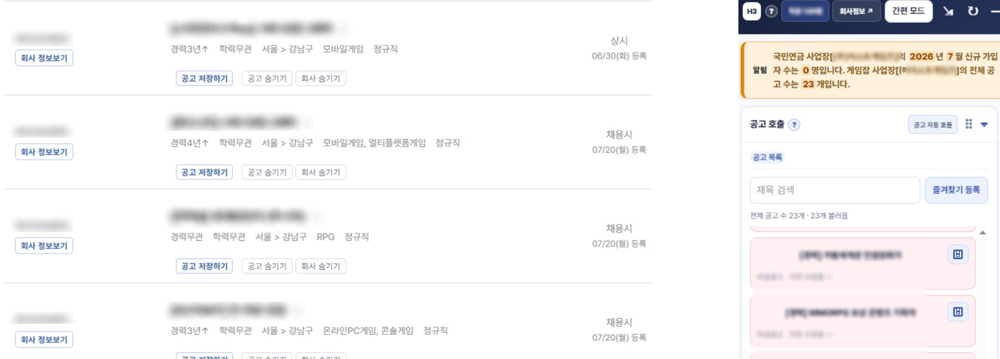
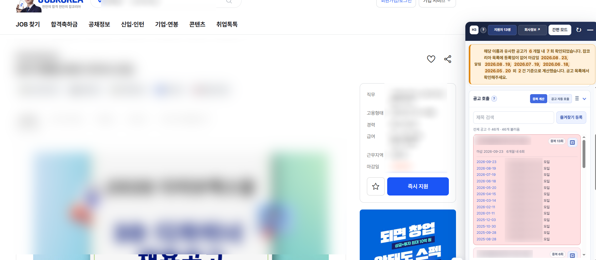

# Hayoung4

### 순도 99.99GPT로 만든 채용공고 보조 확장 프로그램

# [⬇️ 최신 릴리즈 받으러 가기](https://github.com/rlaalswns20031010/Hayoung4/releases)

기존 하영툴에서 포크해서 구조랑 UI를 다시 정리한 버전이야.

잡코리아랑 게임잡 공고를 보다 보면 페이지를 계속 왔다 갔다 해야 하잖아. 그게 귀찮아서 공고 목록, 회사 페이지에 표시된 정보, 직접 불러온 과거 공고 기록을 한 창에서 같이 볼 수 있게 만들었어.

게임잡에서는 국민연금 사업장 가입자 현황도 같이 비교할 수 있어. 다만 국민연금 가입자 수는 직원 수가 아니고, 신고 시점 차이도 있으니까 참고용으로만 보면 됨.

기본값은 **간편 모드**야. 자동 호출 옵션도 있지만 서버에 불필요한 요청을 늘리지 않도록 **수동 사용을 권장**해.

서버 트래픽과 개인정보 보호 문제 때문에 중앙 수집 시스템이나 추가 자동화 기능으로 확장할 생각은 없어. 확인한 내용과 설정은 각자 브라우저 안에서만 관리하는 방향으로 유지할 거야.

## 대충 이런 거 됨

- 잡코리아·게임잡 공고 목록이랑 회사 정보 같이 보기
- 과거 공고를 페이지 단위로 천천히 불러오기
- 제목 검색, 즐겨찾기, 숨기기, 집중 검색
- 불러온 공고 기록을 브라우저에 저장하기
- 게임잡 페이지 표시 사원수랑 국민연금 사업장 가입자 현황 비교하기
- 큼직한 간편 모드와 정보 많은 일반 모드 바꿔 쓰기

## 게임잡 예시

공고 목록 옆에 패널을 띄워서 회사 정보랑 공고 기록을 같이 보는 모습이야.

## 잡코리아 예시

같은 이름으로 반복된 공고를 모아서 보고, 확인한 공고 기록도 같이 볼 수 있어.

## 설치

1. 위에 있는 **최신 릴리즈 받으러 가기**를 누른다.
2. ZIP 파일을 받아서 압축을 푼다.
3. Chrome은 `chrome://extensions`, Brave는 `brave://extensions`로 들어간다.
4. 개발자 모드를 켠다.
5. `압축해제된 확장 프로그램을 로드합니다`를 누른다.
6. 방금 압축을 푼 폴더를 고르면 끝.

기존에 쓰던 사람은 새 파일로 덮어쓰고 확장 프로그램 관리 화면에서 새로고침하면 됨.

## 알아둘 것

- 공고 개수와 실제로 열리는 공고 링크 수가 다를 수 있어.
- 사이트 화면이나 응답 형식이 바뀌면 일부 값이 잠깐 안 나올 수도 있어.
- 국민연금 자료는 공개 시점과 신고 시점 차이 때문에 최신 상황과 다를 수 있어.
- 소규모 사업장은 공개 자료에서 검색되지 않을 수 있어.
- 설정과 기록은 사용자의 브라우저 저장소에 보관돼.

## 데이터 출처

본 프로젝트는 국민연금공단이 공공데이터포털을 통해 제공하는 `국민연금 가입 사업장 내역`을 사용합니다.

- 제공기관: 국민연금공단
- 공개 위치: 공공데이터포털([data.go.kr](https://www.data.go.kr/))
- 이용허락범위: 제한 없음

본 프로젝트는 국민연금공단과 제휴 관계가 아니며, 국민연금공단의 승인 또는 보증을 받은 제품이 아닙니다. 잡코리아와 게임잡의 명칭, 상표 및 각 사이트에서 제공되는 콘텐츠의 권리는 해당 권리자에게 있습니다. 사용자는 각 서비스의 이용약관과 관련 법령을 준수할 책임이 있습니다.

## License

Copyright (c) 2026 Hayoung contributors.

This project is licensed under the MIT License. Permission is granted subject to the terms stated in [LICENSE](LICENSE). The software is provided “AS IS”, without warranty of any kind, express or implied. See the license text for the complete terms and conditions.
